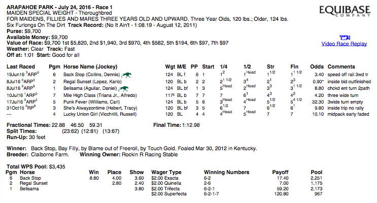
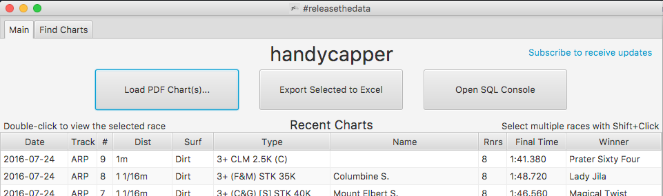
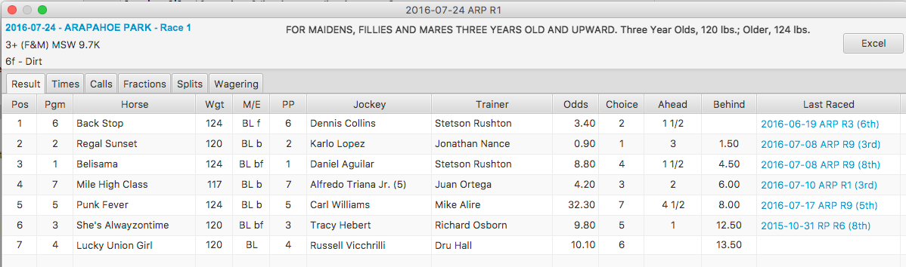
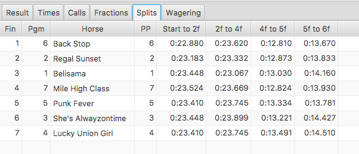
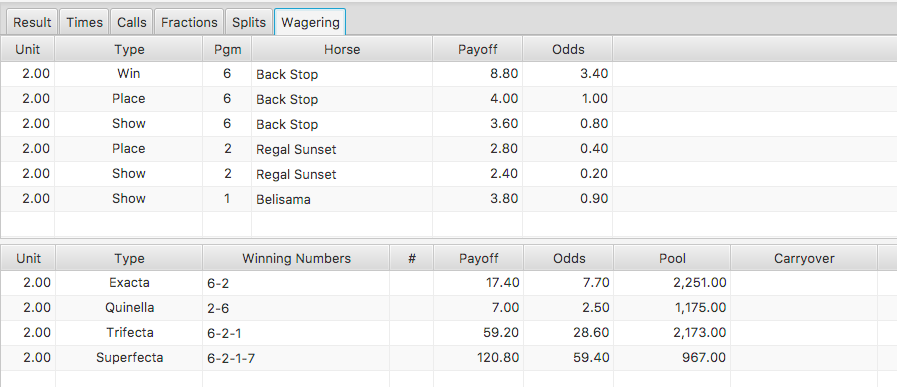
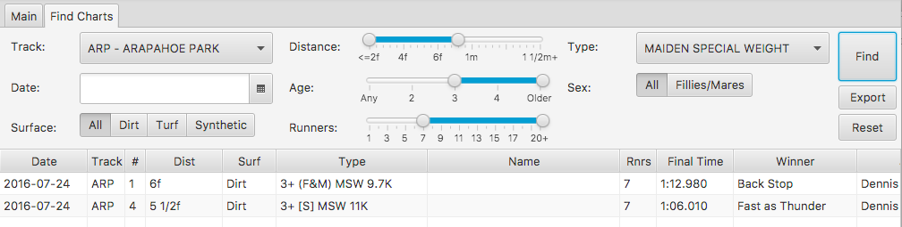
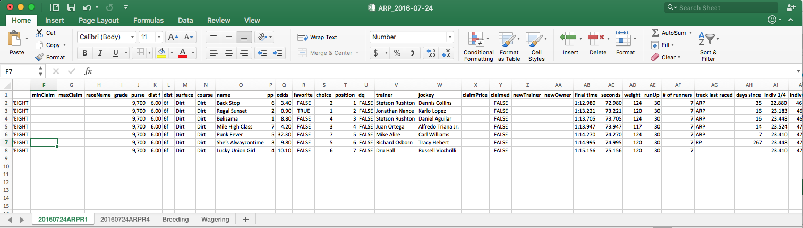
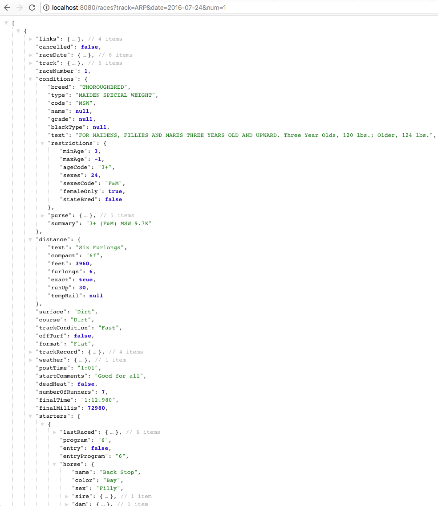
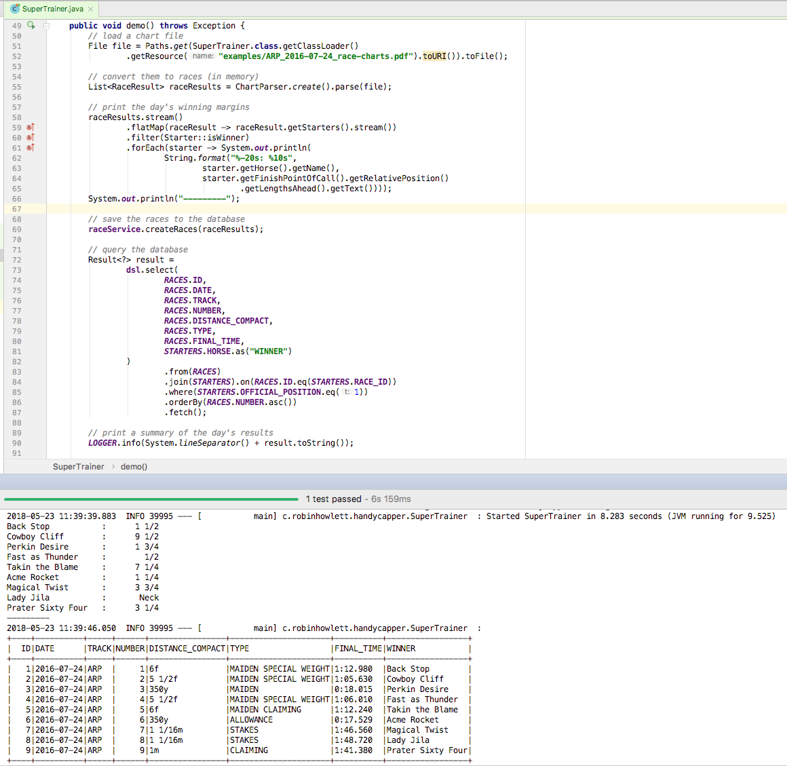
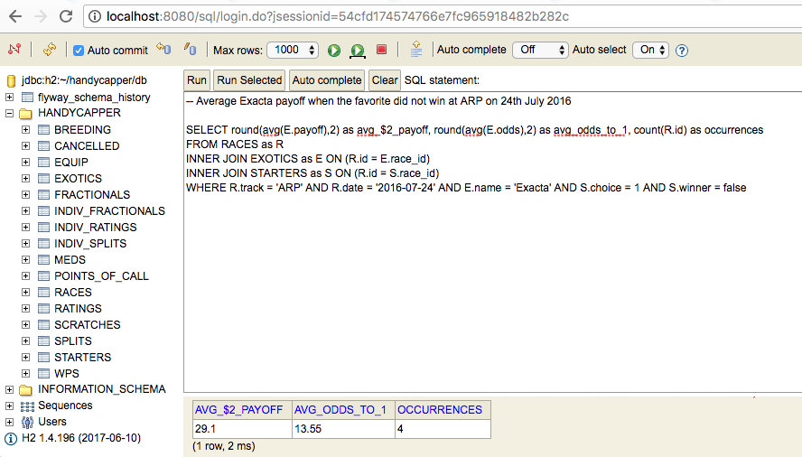

# handycapper

Releases the data from horse racing charts so that it may be explored in fun and creative ways.

Includes:

- a native desktop app that parses PDF charts, saves the data within to an embedded database, and provides a friendly experience for viewing and searching the data
- exporting the data to Microsoft Excel
- exposing the data via a JSON-based REST API
- a Java SDK for programmatic access to the chart data and/or database
- an SQL editor to execute queries against the database

> Version 1.0.1 released on May 24th 2018 to account for a long owner name at SA May 20th 2018 Race 3.

## TL;DR

An Equibase PDF chart results file e.g.

...loaded via the **handycapper** app:

...allows the chart to be consumed in a simpler manner:

...to present new insights:

...be viewed from different perspectives:

...and more easily discovered:

Should you wish to go deeper, export the data and analyze with familiar tools like Excel:

Got a creative streak? Experiment and innovate by integrating the data into new tools and visualizations with the built-in REST API:

User interfaces not your thing? No problem - use the SDK to create software that can work with the chart data and/or the database directly:

And conduct research at a granular level with the full power of SQL:

## Quickstart

1. Download either `Handycapper.app.zip` (MacOS) or `Handycapper-1.0.0.exe.zip` (Windows) from [Releases](https://github.com/robinhowlett/handycapper/releases), unzip, install and start the application.
1. Load an Equibase PDF chart file (for either a single race or even a full raceday) e.g. [2017 Breeders' Cup Day 2](http://www.equibase.com/premium/eqbPDFChartPlus.cfm?RACE=A&BorP=P&TID=DMR&CTRY=USA&DT=11/04/2017&DAY=D&STYLE=EQB)
1. Double-click on a row to open the race view:

> Note: the MacOS `.app` has been signed with my Apple Developer certificate. The `.exe` is not signed and may prompt warnings from your Windows OS. **handycapper** does not require an external network or internet connection to function.

## Technical documentation

- [Database (include schema)](https://github.com/robinhowlett/handycapper/blob/master/docs/database-schema.md)
- [REST API endpoints](https://github.com/robinhowlett/handycapper/blob/master/docs/rest-api.md)
- [JSON API design](https://github.com/robinhowlett/handycapper/blob/master/docs/json-design.md)
	
## FAQ

* **Who created this?**

	[Robin Howlett](https://www.robinhowlett.com/)
	
* **Why?**

	When I moved to the US from Ireland, I was very familiar with horse racing but found the US racing system's size, scope, nomenclature and organization difficult to comprehend. I wanted to see how it all worked - what were the racing circults, how healthy was the industry, how did trainers operate etc. I felt the source data would tell me the story, but the racing data industry's business model is geared towards handicapping software that requires a good deal of prior knowledge to operate effectively and primarily for wagering purposes. I just wanted to explore the raw data and see where it led me.
	
	After connecting with some racing folks on Twitter, I felt a gap existed for regular racing fans to interact with racing data in a highly-flexible, multi-faceted manner:
	
	* to provide the simplest possible solution for someone to get started; users should be able to explore racing data with a one-click installation
	* viewing the chart with an easy-to-use interface that presented the data in a less intimidating manner for less experienced fans
	* using Excel to perform some ad-hoc calculations of their own
	* exposing an API so that new racing experiences, experiments, and media could be created by those perhaps outside of the racing industry today
	* an SDK to provide a reference data model to encourage software engineers to consider horse racing as an accessible 
	* a database for fine-grained data-driven research and to highlight the rich, data- and wagering-centric aspects of the sport

	Also, I enjoy learning new technologies using racing as a domain, and I wanted to demonstrate my product and technical prowess.
	
* **How do you get the data from the chart/PDF?**

	I wrote [Chart Parser](https://github.com/robinhowlett/chart-parser). It basically figures out the meaning of every character in the PDF by its location, value and/or context. By grouping the related characters together, a data model can be built. **handycapper** takes that data model and saves it to a relational database. Once its in a DB, the world's your oyster.

* **How much does it cost?**

	Nothing. It is open-source and MIT licensed.
	
* **What can I do with the data?**

	Both **handycapper** and **Chart Parser** are designed for internal personal non-commercial use *only*. The data that Equibase provides in the PDF charts belongs to them and you should be aware of and respect their terms of use. 
	
	This project contains and references [a single sample Equibase PDF chart](https://github.com/robinhowlett/handycapper/blob/master/src/test/resources/examples) included for testing, educational and demonstration purposes only.
	
* **What technologies does it use?**

	Lots, but primarily Java 8, Spring Boot, JavaFX & ControlsFX, H2, jOOQ, Apache PDFBox, Apache POI, Flyway, Jetty, Jackson, Bouncy Castle
	
* **Can I use a different database engine?**

Yes - both MySQL and PostgreSQL have support out of the box, though to use them you must build from source via Maven and the `mysql` and `postgresql` Maven Profiles declared in the pom.xml file respectively. Usernames and password configuration in `application-mysql.properties` and `application-postgresql.properties` will need to be modified. The default Maven and Spring profile is `h2`.
	
* **Should I use this for handicapping and wagering decisions?**

	If you wish but I would strongly discourage it. The professional products out there (Equibase, OptixEQ, STATS Race Lens, DRF Formulator etc.) are designed for this and you should buy and use those instead.
	
* **Can I pay you?**

	Nah. Donate to a charity instead.
	
## Feedback

Feedback, requests, bugs etc. can be sent to me via:

<ul><li>robin.howlett <i>at</i> gmail.com</li>
<li>Twitter: <a href="https://www.twitter.com/robinhowlett">@robinhowlett</a></li>

	
	
