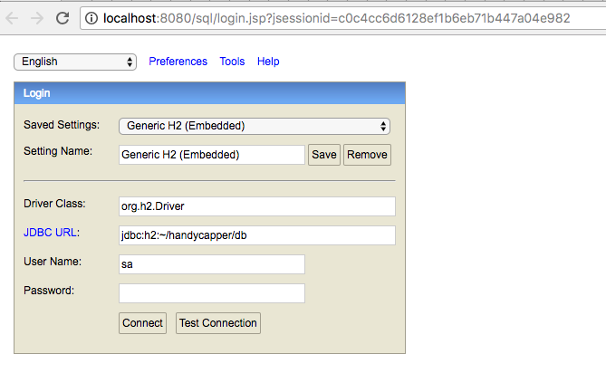
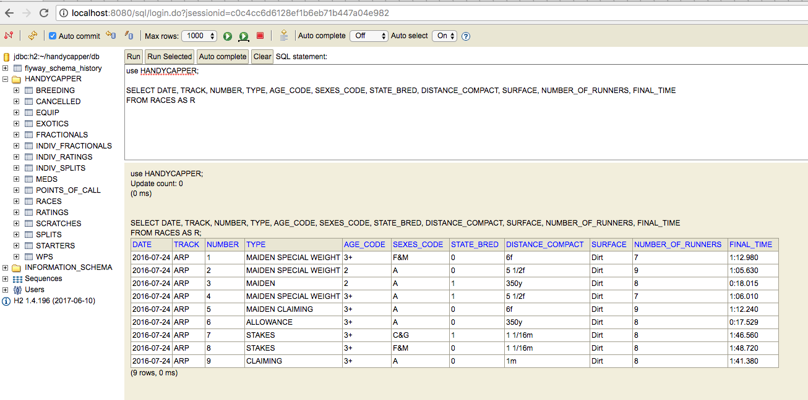
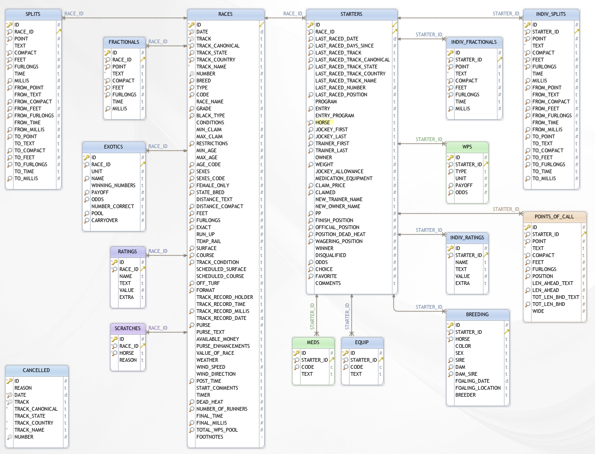

# Database

## Connecting to the H2 Console

> Note: the Handycapper app must be running to access the H2 Console

URL: [http://localhost:8080/sql]()

The following default settings will provide access to the file-based H2 database:

* JDBC URL: `jdbc:h2:~/handycapper/db`
* User Name: `sa`
* Password:

> Note: by default, there is no password set. The "Test Connection" button should display "Test successful" if the connection parameters are correct.

## Console

> Note: the console's session will occasionally timeout and log out. You may lose your work. Consider an external database tool. Some tools will require a exclusive lock on the file database and therefore the Handycapper app must not be running.

## Schema

`RACES` and `STARTERS` are the primary tables.

> The [JSON API design](../json-design.md) document can aid understanding the purpose of many of the columns above.

## Sample queries

Coming soon! 
